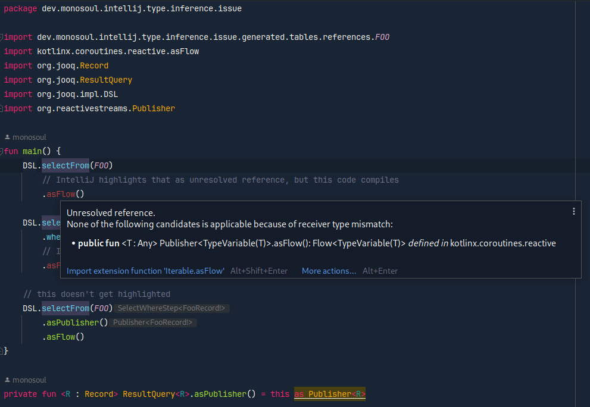

# A reproducer for type inference issue in IntelliJ

IntelliJ IDEA is unable to infer `Publisher` type from most (if not all) [jOOQ](https://www.jooq.org/) types that
implement `Publisher` type deep in the class hierarchy.

Pre-requisites:
 - JVM 17 to run the build
 - Docker to run `generateJooqClasses` task

Steps to reproduce:
 - open the project with intellij
 - build it

Expected result:
 - build succeeds
 - IntelliJ doesn't show any errors for the code

Actual result:
 - build succeeds
 - IntelliJ highlights `asFlow` usages as errors

